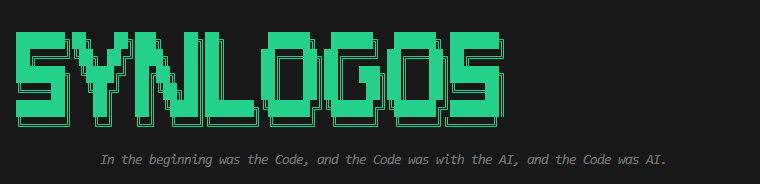

A professional multi-provider AI coding agent built with functional programming patterns in Python. Synlogos acts as your autonomous coding companion, supporting multiple LLM providers and specialized agent types for different coding tasks.

## Features

- **Multi-Provider Support** — Works with opencode.ai (free), TogetherAI, Ollama (local), Groq, and any OpenAI-compatible API
- **Specialized Agent Types** — Different agents optimized for specific tasks:
  - `explore` — Fast file and codebase exploration
  - `code` — Primary coding agent for complex tasks
  - `architect` — System design and architecture decisions
  - `plan` — Task planning and analysis
  - `grep` — Search specialist
  - `summarize` — Code and diff summarization
  - `web_search` — Web information retrieval
  - `memory` — Memory management agent
- **JSON Configuration** — Simple `synlogos.json` config file for providers and agents
- **Programmatic Tool Calling** — LLM writes code that orchestrates multiple tools efficiently
- **Functional Architecture** — Built with Result monads, immutable state, and pure functions
- **Rich Tool Set**:
  - File operations: read, write, edit
  - Shell command execution
  - Code execution in sandboxed environment
  - File search: glob patterns, grep/regex search
  - Git integration: status, diff, log, commit
- **Beautiful CLI** — Rich terminal output with markdown rendering
- **Safe Execution** — Local sandbox for isolated code execution

## Installation

```bash
# Clone the repository
git clone https://github.com/RakiDelmoro/synlogos-coding-agent.git
cd synlogos-coding-agent

# Install with pip
pip install -e .

# Or install with development dependencies
pip install -e ".[dev]"
```

## Configuration

Synlogos uses `synlogos.json` for configuration. Create this file in your project root:

```json
{
  "$schema": "https://opencode.ai/config.json",
  "theme": "matrix",
  "instructions": ["SOUL.md"],
  "provider": {
    "opencode": {
      "npm": "@ai-sdk/openai-compatible",
      "options": {
        "baseURL": "https://opencode.ai/zen/v1",
        "apiKey": "your-api-key"
      },
      "models": {
        "glm-5-free": { "model": "glm-5-free" },
        "kimi-k2-free": { "model": "kimi-k2-free" }
      }
    },
    "ollama": {
      "npm": "@ai-sdk/openai-compatible",
      "options": {
        "baseURL": "http://localhost:11434/v1"
      },
      "models": {
        "qwen3:8b": { "model": "qwen3:8b" }
      }
    },
    "togetherai": {
      "npm": "@ai-sdk/openai-compatible",
      "options": {
        "baseURL": "https://api.together.xyz/v1",
        "apiKey": "your-api-key"
      },
      "models": {
        "moonshotai/Kimi-K2.5": {}
      }
    }
  },
  "model": "togetherai/moonshotai/Kimi-K2.5",
  "agent": {
    "explore": {
      "model": "ollama/qwen3:8b",
      "instructions": "You are a fast file and codebase explorer..."
    },
    "code": {
      "model": "togetherai/moonshotai/Kimi-K2.5",
      "instructions": "You are the primary coding agent..."
    }
  }
}
```

### Provider Setup

**Free Options:**
- **opencode.ai** — Get free API key at https://opencode.ai (no signup required)
- **Ollama** — Run locally: `ollama pull qwen3:8b && ollama serve`

**Commercial Options:**
- **TogetherAI** — Get API key at https://api.together.xyz/settings/api-keys
- **Groq** — Get free tier API key at https://console.groq.com/keys

## Quick Start

1. Create your `synlogos.json` config file (see example above)

2. Run Synlogos:

```bash
# Default agent
synlogos

# Or use a specific agent type
synlogos --agent explore
synlogos --agent code
synlogos --agent architect

# See available agents
synlogos --list-agents

# See configured providers
synlogos --list-providers
```

## Usage

Once started, you'll see an interactive prompt. Just describe what you want to do:

```
You: Create a Python function that calculates fibonacci numbers and write it to fib.py

You: Read all the TypeScript files in src/ and summarize their purpose

You: Run the tests and fix any failing tests

You: Commit the changes with a descriptive message
```

Type `exit` or `quit` to end the session.

### Slash Commands

While the agent is running, you can use slash commands for quick actions:

```
/help              Show available slash commands
/agents            List all available agent types
/provider          Show current provider and model
/providers         List all configured providers
/tokens            Show current token usage
/config            Show current configuration
clear              Clear the screen
/exit              Exit the session (same as 'exit')
```

Example:
```
You: /help
You: /agents
You: /tokens
You: /provider
```

### CLI Options

```
synlogos [options]

Options:
  --agent TYPE          Agent type: explore, code, architect, plan, grep, summarize, web_search, memory
  --list-agents         Show available agents and exit
  --list-providers      Show configured providers and exit
  --config PATH         Path to synlogos.json config file
  --max-turns N         Maximum conversation turns (default: 30)
  -h, --help            Show help message
```

## Architecture

Synlogos is built with functional programming principles:

- **Result Monads** — Explicit error handling using the `returns` library
- **Immutable State** — State is threaded through pure functions, never mutated
- **Multi-Provider Design** — Unified OpenAI-compatible API wrapper for all providers
- **JSON-Based Config** — Simple declarative configuration
- **Specialized Agents** — Each agent type has optimized models and instructions

```
src/
├── agent/              # Agent implementations
│   └── synlogos.py     # Main Synlogos agent with multi-provider support
├── providers/          # LLM providers (unified interface)
│   ├── unified_provider.py  # Universal OpenAI-compatible provider
│   ├── groq_provider.py     # Groq provider
│   └── ollama_provider.py   # Ollama provider
├── config.py           # JSON config loader
├── sandbox/            # Code execution sandbox
├── tools/              # Tool implementations
│   ├── functional_tools.py  # File ops, shell, code exec
│   ├── advanced_tools.py    # Glob, grep
│   └── git_tools.py         # Git operations
├── types.py            # Type definitions
└── cli.py              # CLI entry point
```

## How It Works

1. **Configuration** — Load `synlogos.json` to determine provider and model
2. **Agent Selection** — Choose agent type (each has its own model and instructions)
3. **Prompt Processing** — User prompt sent to selected LLM
4. **Tool Orchestration** — LLM generates Python code that calls tools
5. **Execution** — Code runs in sandbox, tools execute operations
6. **Results** — Final results returned to user

## Requirements

- Python 3.11+
- API key for your chosen provider (or run Ollama locally)
- Docker (optional, for sandboxed code execution)

## Dependencies

- `openai` — OpenAI SDK (for OpenAI-compatible APIs)
- `pydantic` — Data validation
- `returns` — Result monads for functional error handling
- `rich` — Beautiful terminal output
- `aiofiles` — Async file operations
- `httpx` — HTTP client

## Development

```bash
# Install dev dependencies
pip install -e ".[dev]"

# Run linting
ruff check .

# Run type checking
mypy src/

# Run tests
pytest
```

## Migrating from v1

If you were using Synlogos v1 (TogetherAI-only):

1. Update your environment variables:
   - Remove: `TOGETHER_API_KEY`
   - Add: Create `synlogos.json` config file

2. Update imports (if using programmatically):
   ```python
   # Old
   from src.types import AgentConfig
   config = AgentConfig(model="meta-llama/...")
   
   # New
   from src.agent.synlogos import Synlogos
   agent = Synlogos(agent_type="code")
   ```

## License

MIT License — see [LICENSE](LICENSE) for details.

## Contributing

Contributions are welcome! Please feel free to submit a Pull Request.

## Acknowledgments

Built with love using:
- [OpenCode](https://opencode.ai) — Free AI model access
- [TogetherAI](https://together.ai) — Fast, affordable LLM inference
- [Ollama](https://ollama.ai) — Local LLM inference
- [Groq](https://groq.com) — Fast inference
- [Rich](https://github.com/Textualize/rich) — Beautiful terminal formatting
- [Returns](https://github.com/dry-python/returns) — Functional programming in Python
